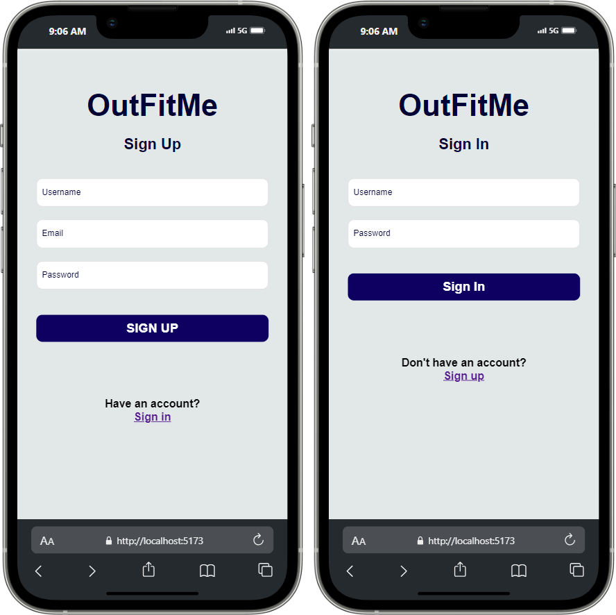
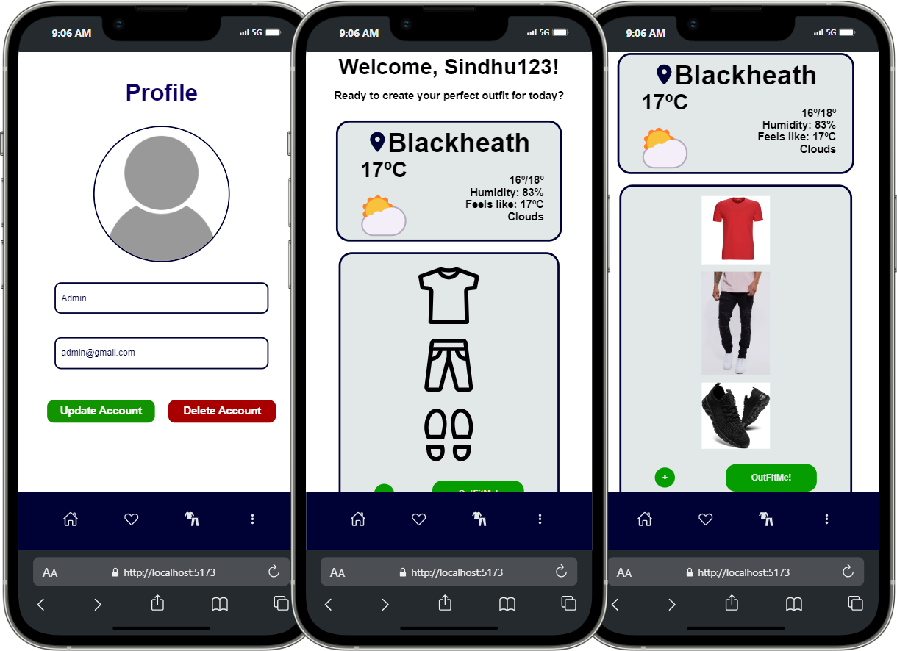
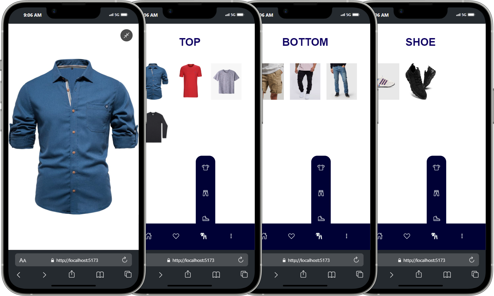

<a id="readme-top"></a>

<br />
<div align="center">
  <a href="https://github.com/Sind96/OutFitMe">
    
  </a>

<h3 align="center">OutFitMe</h3>

  <p align="center">
    "Your Personal Digital Stylist & Weather-Ready Wardrobe!"
    <br />
  </p>
</div>

<!-- TABLE OF CONTENTS -->
<details>
  <summary>Table of Contents</summary>
  <ol>
    <li>
      <a href="#about-the-project">About The Project</a>
      <ul>
        <li><a href="#built-with">Built With</a></li>
      </ul>
    </li>
    <li>
      <a href="#getting-started">Getting Started</a>
      <ul>
        <li><a href="#prerequisites">Prerequisites</a></li>
        <li><a href="#installation">Installation</a></li>
      </ul>
    </li>
    <li><a href="#usage">Usage</a></li>
    <li><a href="#contributing">Contributing</a></li>
    <li><a href="#license">License</a></li>
    <li><a href="#contact">Contact</a></li>
  </ol>
</details>

<!-- ABOUT THE PROJECT -->

## About The Project

OutFitMe is a user-friendly application that enables users to upload pictures of their clothing and tag them by type and optimal weather conditions (temperature range, rain suitability, etc.). With a simple click, users can generate outfits tailored to the day's weather forecast.

The outfit randomizer display includes a live weather update for the user's location. Additionally, the sidebar features icons that lead to galleries of all uploaded items categorized by type.

<div align='center'>
 <br>
 <br>

</div>

<p align="right">(<a href="#readme-top">back to top</a>)</p>

### Built With

[![React.js][React.js]][React-url]
[![Vite][Vite]][Vite-url]
[![TypeScript][TypeScript]][TypeScript-url]
[![Redux][Redux]][Redux-url]
[![MongoDB][Mongo-Db]][Mongo-Db-url]
[![Git][Git]][Git-url]
[![GitHub][GitHub]][GitHub-url]
[![ESLint][ESLint]][ESLint-url]
[![Prettier][Prettier]][Prettier-url]

<p align="right">(<a href="#readme-top">back to top</a>)</p>

<!-- GETTING STARTED -->

## Getting Started

In order to get OutFitMe to work, there are two external services that need to be connected to the app. You will need to gather their information and store it in a .env file:

### Prerequisites

- [npm](https://docs.npmjs.com/downloading-and-installing-node-js-and-npm)

  ```sh
  npm install npm@latest -g
  ```

- Obtain API key for:

  - [OpenWeatherMap API ](https://openweathermap.org/):

    - Go to https://openweathermap.org/ and get a free membership.
    - Once logged in, locate your username drop down in the navbar, and navigate to "My API Keys".
    - In "My API Keys" make sure you have an **Active** key, and save its **Key** and **Name** to add them to the .env file.

  - [Cloudinary API ](https://cloudinary.com/):

    - Go to https://cloudinary.com/ and get a free membership.
    - Once logged in, locate the "Assets" icon at the top of the sidebar and click on it.
    - Here you can create a new folder to upload pictures to, name it however you want and save the **Folder name** to add it to the .env file.
    - Now locate the settings icon at the bottom of the sidebar, and click on it.
    - In "Settings", another sidebar will become visible. Click on "API Keys" and save your **Cloud name** to add it to the .env file.
    - Make sure you have an **Active** key, and save its **API Key** and **API Secret** to add them to the .env file.
    - In "Settings", click on "Upload Presets" and add a new preset with Signing mode **Unsigned**. Leave all other options as is and save it, then save its **Name** to add it to the .env file.

Once you have collected all necessary information from both services, create a .env file in the client folder, and add the information like this:

```
VITE_CLOUD_NAME=placeholder
VITE_UPLOAD_PRESET=placeholder
VITE_CLOUDINARY_FOLDER=placeholder
VITE_CLOUDINARY_API_KEY=placeholder
VITE_CLOUDINARY_API_SECRET=placeholder

VITE_OPENWEATHER_API_NAME=placeholder
VITE_OPENWEATHER_API_KEY=placeholder
```

### Installation

1. Clone the repo

   ```sh
   git clone github.com/Sind96/OutFitMe
   ```

2. Create your own .env file and insert the Api Keys as mentioned in (<a href="#Prerequisites">Prerequisites</a>)

3. Install NPM packages in both client and server folders

   ```sh
   npm install
   ```

4. Start the app in both the client and server folders
   ```sh
   client: npm run dev
   server: nodemon server.js
   ```

<p align="right">(<a href="#readme-top">back to top</a>)</p>

<!-- LICENSE -->

## License

Distributed under the MIT License. See `license.txt` for more information.

<p align="right">(<a href="#readme-top">back to top</a>)</p>

<!-- CONTACT -->

## Contact

Charbel Rouhana - [Github](https://github.com/Charbel-r) - [LinkedIn](https://www.linkedin.com/in/charbel-rouhana-0b6311135/) - charbelmrouhana@gmail.com

Sindhu Yogu - [Github](https://github.com/Sind96) - [LinkedIn](www.linkedin.com/in/sindhu-yogu-657057318) - sindy96jan@gmail.com

Sulo Siguur- [Github](https://github.com/Runicsaber) - [LinkedIn](https://www.linkedin.com/in/sulo-siigur-34a932225/) - sulo.siigur@gmail.com

<!-- MARKDOWN LINKS & IMAGES -->
<!-- https://www.markdownguide.org/basic-syntax/#reference-style-links -->

[React.js]: https://img.shields.io/badge/React-20232A?style=for-the-badge&logo=react&logoColor=61DAFB
[React-url]: https://reactjs.org/
[ESLint]: https://img.shields.io/badge/eslint-3A33D1?style=for-the-badge&logo=eslint&logoColor=white
[ESLint-url]: https://eslint.org/
[Prettier]: https://img.shields.io/badge/prettier-1A2C34?style=for-the-badge&logo=prettier&logoColor=F7BA3E
[Prettier-url]: https://prettier.io/
[TypeScript-url]: https://www.typescriptlang.org/
[TypeScript]: https://shields.io/badge/TypeScript-3178C6?logo=TypeScript&logoColor=FFF&style=for-the-badge
[Next.js]: https://img.shields.io/badge/next.js-000000?style=for-the-badge&logo=nextdotjs&logoColor=white
[Next-url]: https://nextjs.org/
[Git-url]: https://git-scm.com/
[Git]: https://img.shields.io/badge/GIT-E44C30?style=for-the-badge&logo=git&logoColor=white
[GitHub-url]: https://github.com/
[GitHub]: https://img.shields.io/badge/GitHub-100000?style=for-the-badge&logo=github&logoColor=white
[Shadcn-url]: https://ui.shadcn.com/
[Shadcn]: https://img.shields.io/badge/shadcn%2Fui-000?logo=shadcnui&logoColor=fff&style=for-the-badge
[Redux]: https://img.shields.io/badge/redux-%23593D88?style=for-the-badge&logo=redux&logoColor=white
[Redux-url]: https://redux-toolkit.js.org/
[ClerkAuth]: https://img.shields.io/badge/Clerk-6C47FF?logo=clerk&logoColor=fff&style=for-the-badge
[ClerkAuth-url]: https://clerk.com/
[Mongo-Db]: https://img.shields.io/badge/MongoDB-%234ea94b.svg?style=for-the-badge&logo=mongodb&logoColor=white
[Mongo-Db-url]: https://www.mongodb.com/docs/atlas/getting-started/
[Threejs]: https://img.shields.io/badge/threejs-black?style=for-the-badge&logo=three.js&logoColor=white
[Threejs-url]: https://threejs.org/
[TailwindCSS]: https://img.shields.io/badge/tailwindcss-%2338B2AC.svg?style=for-the-badge&logo=tailwind-css&logoColor=white
[TailwindCSS-url]: https://tailwindcss.com/docs/installation
[Vercel]: https://img.shields.io/badge/vercel-%23000000.svg?style=for-the-badge&logo=vercel&logoColor=white
[Vercel-url]: https://vercel.com/docs
[Prisma]: https://img.shields.io/badge/Prisma-3982CE?style=for-the-badge&logo=Prisma&logoColor=white
[Prisma-url]: https://www.prisma.io/docs
[Vite]: https://img.shields.io/badge/vite-%23646CFF.svg?style=for-the-badge&logo=vite&logoColor=white
[Vite-url]: https://vitejs.dev/
