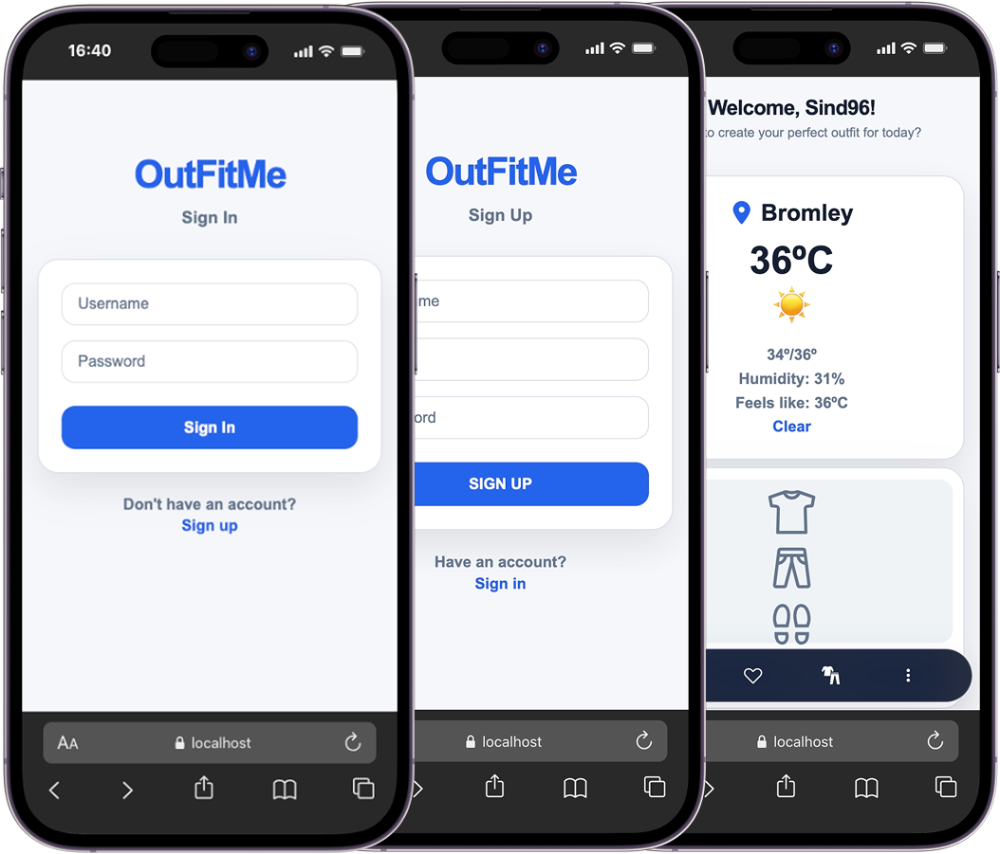

<a id="readme-top"></a>
<br />

<div align="center">
  <a href="https://github.com/Sind96/OutFitMe">
    
  </a>
</div>
<!-- ABOUT THE PROJECT -->

## About the Project

OutFitMe is a full-stack wardrobe management application that generates weather-appropriate outfits using clothing uploaded by each individual user.

Users can create an account, upload clothing items, generate weather-appropriate outfits, save favourite combinations, and manage their personal wardrobe. Each user's wardrobe is stored independently, ensuring complete separation of wardrobe data between user accounts.

<!-- TABLE OF CONTENTS -->
<details>
  <summary>Table of Contents</summary>
  <ol>
    <li><a href="#built-with">Built With</a></li>
    <li><a href="#screenshots">Screenshots</a></li>
    <li><a href="#features">Features</a></li>
    <li><a href="#project-structure">Project Structure</a></li>
    <li><a href="#getting-started">Getting Started</a></li>
    <li><a href="#license">License</a></li>
  </ol>
</details>

## Built With

[![React.js][React.js]][React-url]
[![TypeScript][TypeScript]][TypeScript-url]
[![Express.js][Express.js]][Express.js-url]
[![MongoDB][Mongo-Db]][Mongo-Db-url]
[![Redux][Redux]][Redux-url]
[![Vite][Vite]][Vite-url]
[![Vitest][Vitest]][Vitest-url]
[![Jest][Jest]][Jest-url]
[![JWT][JWT]][JWT]
[![Cloudinary-Badge][Cloudinary-Badge]][Cloudinary-Badge-url]

<!-- Screenshots -->

## Screenshots

<p align="center">
  
</p>

<!-- Features -->

## Features

- User authentication with JWT
- Secure password hashing using bcrypt
- Upload wardrobe items
- Weather-based outfit generation
- Favourite outfit management
- User-specific wardrobes
- Responsive mobile-first design
- Profile management
- Secure user-specific wardrobe storage
- Image zoom
- Toast notifications
- Loading and error states
- Unit and integration testing

<!-- Project Structure -->

## Project Structure

```text
client/
├── components/
├── hooks/
├── pages/
├── services/
├── store/
├── tests/
└── types/

server/
├── controllers/
├── middleware/
├── models/
├── routes/
├── tests/
├── utils/
└── validation/
```

<!-- GETTING STARTED -->

## Getting Started

To run OutFitMe locally, you'll need accounts for the following services:

- OpenWeather API
- Cloudinary
- MongoDB Atlas

### Prerequisites

- Install the latest version of [npm](https://docs.npmjs.com/downloading-and-installing-node-js-and-npm).

  ```sh
  npm install -g npm
  ```

- Create free accounts for:
  - [OpenWeatherMap API ](https://openweathermap.org/):
    - Once logged in, locate your username drop down in the navbar, and navigate to "My API Keys" and obtain an API key.

  - [Cloudinary API ](https://cloudinary.com/):
    - Create an unsigned upload preset and note your Cloud Name, Upload Preset and Folder Name.

  - [MongoDB Database](https://www.mongodb.com/atlas/database):
    - Create a cluster and copy your MongoDB connection string.

### Installation

1. Clone the repository.

   ```sh
   git clone https://github.com/Sind96/OutFitMe.git
   ```

2. Install the frontend dependencies.

   ```sh
   cd client
   npm install
   ```

3. Install the backend dependencies.

   ```sh
   cd ../server
   npm install
   ```

Create your own .env file and insert the API Keys as mentioned in (<a href="#Prerequisites">Prerequisites</a>)

4. Copy the example environment files.

   ```sh
   Backend
   cp .env.example .env
   ```

   ```sh
   Frontend
   cd ../client
   cp .env.local.example .env.local
   ```

5. Populate both environment files with your own credentials.

6. Start the backend.

   ```sh
   cd ../server
   npm run dev
   ```

7. Start the frontend.

   ```sh
   cd ../client
   npm run dev
   ```

<p align="right">(<a href="#readme-top">back to top</a>)</p>
<!-- LICENSE -->
## License
Distributed under the MIT License. See `license.txt` for more information.
<p align="right">(<a href="#readme-top">back to top</a>)</p>

<!-- MARKDOWN LINKS & IMAGES -->
<!-- https://www.markdownguide.org/basic-syntax/#reference-style-links -->
<!-- Additional reusable badge definitions -->

[React.js]: https://img.shields.io/badge/React-20232A?style=for-the-badge&logo=react&logoColor=61DAFB
[React-url]: https://reactjs.org/
[Express.js]: https://img.shields.io/badge/Express-000000?style=for-the-badge&logo=express&logoColor=white
[Express.js-url]: https://expressjs.com/en/
[ESLint]: https://img.shields.io/badge/eslint-3A33D1?style=for-the-badge&logo=eslint&logoColor=white
[ESLint-url]: https://eslint.org/
[Prettier]: https://img.shields.io/badge/prettier-1A2C34?style=for-the-badge&logo=prettier&logoColor=F7BA3E
[Prettier-url]: https://prettier.io/
[TypeScript-url]: https://www.typescriptlang.org/
[TypeScript]: https://shields.io/badge/TypeScript-3178C6?logo=TypeScript&logoColor=FFF&style=for-the-badge
[Next.js]: https://img.shields.io/badge/next.js-000000?style=for-the-badge&logo=nextdotjs&logoColor=white
[Next-url]: https://nextjs.org/
[Git-url]: https://git-scm.com/
[Git]: https://img.shields.io/badge/GIT-E44C30?style=for-the-badge&logo=git&logoColor=white
[GitHub-url]: https://github.com/
[GitHub]: https://img.shields.io/badge/GitHub-100000?style=for-the-badge&logo=github&logoColor=white
[Shadcn-url]: https://ui.shadcn.com/
[Shadcn]: https://img.shields.io/badge/shadcn%2Fui-000?logo=shadcnui&logoColor=fff&style=for-the-badge
[Redux]: https://img.shields.io/badge/redux-%23593D88?style=for-the-badge&logo=redux&logoColor=white
[Redux-url]: https://redux-toolkit.js.org/
[ClerkAuth]: https://img.shields.io/badge/Clerk-6C47FF?logo=clerk&logoColor=fff&style=for-the-badge
[ClerkAuth-url]: https://clerk.com/
[Mongo-Db]: https://img.shields.io/badge/MongoDB-%234ea94b.svg?style=for-the-badge&logo=mongodb&logoColor=white
[Mongo-Db-url]: https://www.mongodb.com/docs/atlas/getting-started/
[Threejs]: https://img.shields.io/badge/threejs-black?style=for-the-badge&logo=three.js&logoColor=white
[Threejs-url]: https://threejs.org/
[TailwindCSS]: https://img.shields.io/badge/tailwindcss-%2338B2AC.svg?style=for-the-badge&logo=tailwind-css&logoColor=white
[TailwindCSS-url]: https://tailwindcss.com/docs/installation
[Vercel]: https://img.shields.io/badge/vercel-%23000000.svg?style=for-the-badge&logo=vercel&logoColor=white
[Vercel-url]: https://vercel.com/docs
[Prisma]: https://img.shields.io/badge/Prisma-3982CE?style=for-the-badge&logo=Prisma&logoColor=white
[Prisma-url]: https://www.prisma.io/docs
[Vite]: https://img.shields.io/badge/vite-%23646CFF.svg?style=for-the-badge&logo=vite&logoColor=white
[Vite-url]: https://vitejs.dev/
[Vitest]: https://img.shields.io/badge/Vitest-6E9F18?style=for-the-badge&logo=vitest&logoColor=white
[Vitest-url]: https://vitest.dev/
[Jest]: https://img.shields.io/badge/-jest-%23C21325?style=for-the-badge&logo=jest&logoColor=white
[Jest-url]: https://jestjs.io/docs/getting-started
[Koa]: https://img.shields.io/badge/Koa-33333D?logo=koa&logoColor=fff&style=for-the-badge
[Koa-url]: https://koajs.com/#introduction
[JWT]: https://img.shields.io/badge/JWT-black?style=for-the-badge&logo=JSON%20web%20tokens
[JWT-url]: https://jwt.io/introduction
[Cloudinary-Badge]: https://img.shields.io/badge/Cloudinary-3448C5?logo=cloudinary&logoColor=fff&style=for-the-badge
[Cloudinary-Badge-url]: https://cloudinary.com/documentation

```

```
